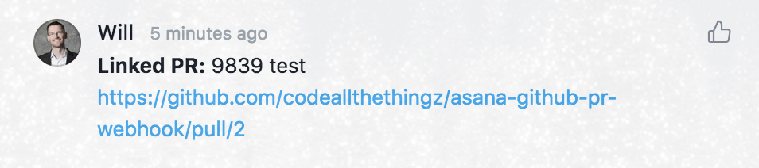
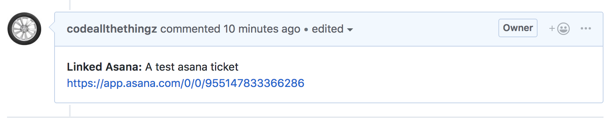

# Asana Github PR Webhook

[](https://circleci.com/gh/codeallthethingz/asana-github-pr-webhook/tree/master)
[](https://standardjs.com)
[](https://codecov.io/gh/codeallthethingz/asana-github-pr-webhook)

## Updates from codeallthethingz's original repo

- [x] Get asana task ID from PR description instead of 4 digits
- [x] Use Vercel's environment variables

Links a PR in asana when a new Pull Request is created in Github with the task url in the description.

## Usage

Include a link to the asana ticket in the PR description. The last segment of the URL will be used to find the task:

```
# PR description example
Fix things. See [Asana Task](https://app.asana.com/1/2)
```

See a link to the PR appear as a comment on that task in Asana.

<kbd><kbd>

See a link to the Asana task appear as a comment on the PR.

<kbd></kbd>

## Installation

### 1. Get an Asana access token

- To get an [access token](https://app.asana.com/0/developer-console) go to 'My Profile Settings' -> Apps -> 'Manage Developer Apps' -> 'Create new personal access token'.
- Make a note of the access token as you'll need it later on. `<asana access token>`

### 2. Get your Asana workspace id

- Make sure you're logged in to asana and go to `https://app.asana.com/api/1.0/workspaces`
- Make a note of the gid as you'll need it later on. `<workspace id>`

### 3. Get an Github access token

- To get an access token go to 'Settings' -> 'Developer Settings' -> 'Personal Access Token' -> 'Generate new token'.
- Under 'scopes' select 'Repo'.
- Make a note of the access token as you'll need it later on. `<github access token>`

### 4. Deploy the application

This project uses [Vercel](https://vercel.com/) to deploy, which requires only a github account and gives you unlimited free invocations a month.

- Create a long, random password that we'll refer to as `<webhook secret>`
- Fork this repo and download it.
- Change the `now.json` config to choose a different alias as you won't be able to use the default.  We'll refer to this URL as `<url>`
- Run `npm install`
- Run 
    ```bash
    vercel --prod \
      -e WEBHOOK_SECRET="<webhook secret>" \
      -e ASANA_ACCESS_TOKEN="<asana access token from step 1>"\
      -e WORKSPACE_ID="<workspace id from step 2>"\
      -e GITHUB_ACCESS_TOKEN="<github access token from step 3>"
    ```
- Go to vercel.com -> asana-github-pr-webhook project -> Settings -> Domains to retrieve a non-changing URL for step 5

### 5. Setup webhooks in Github

- For the github project you want to integrate, go to settings -> webhooks -> add a new webhook.
- Set the Payload URL to `https://<url from step 4>/webhook.js`
- Set the content type to `application/json`
- Set the secret to `<webhook secret>`
- Set the events to 'Let me select individual events' and check the box next to 'Pull Requests'
- Save.

Everything should work.

## Contributing

### Folder structure
```
src/
  asana.js      # Client for querying asana through asanator
  asanator.js   # Interface over asana APIs
  github.js     # Client for querying github through githubator
  githubator.js # Interface over github APIs
  processor.js  # Glue github and asana clients together
webhook.js    # Process requests incoming from github
```

### Useful Commands
```
npm      # Install dependencies
npm test # Run tests
```
